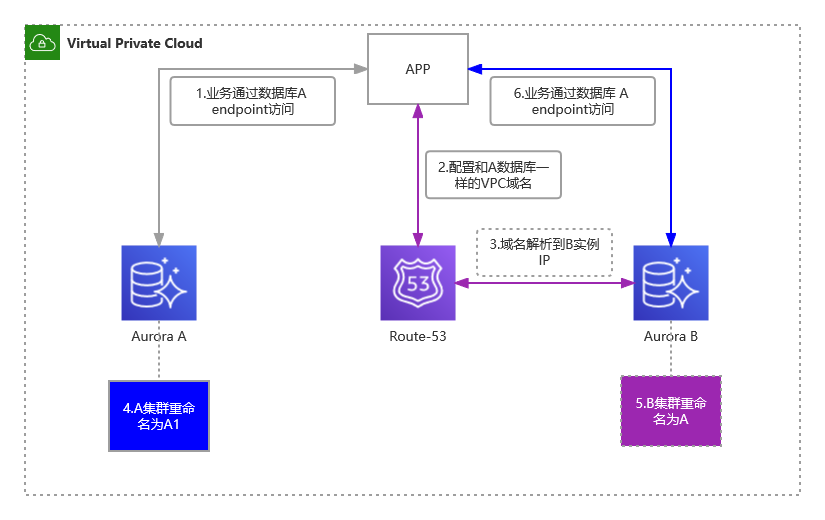

# DNS劫持&RDS数据库无代码入侵切换
## 使用场景
适用于AWS上由于数据库变更，但是业务层不想修改数据`endpoint`,或者修改会有很大的成本的场景。

## 方案概述
在Router53中建议一个和数据库集群`endpoint`一样的VPC域名，同时解析到新数据库IP，实现劫持，便可以访问到最新的数据库。再然后修改原数据库集群标识符，修改完成后把新集群的标识符改为原集群标识符后，删除Router53中域名，完成切换。流程图如下：


## 操作步骤
假设已有两个集群A、B，各有一个写入器，两个集群的写入器endpoint分别为`database-A.xxx.com`和`database-B.xxx.com`。业务代码中使用的是A集群的endpoint。如下：
```php
<?php
$servername = "database-A.xxx.com";
$username = "username";
$password = "password";
 
// 创建连接
$conn = new mysqli($servername, $username, $password);
 
// 检测连接
if ($conn->connect_error) {
    die("连接失败: " . $conn->connect_error);
} 
echo "连接成功";
?>

```
以下演示通过aws cli 操作。
### 创建VPC内`database-A.xxx.com`的域名
```shell
aws route53 create-hosted-zone --name database-A.xxx.com --vpc VPCRegion=us-east-1,VPCId=vpc-xxx --caller-reference 2014-04-01-18:47 --hosted-zone-config Comment="command-line version"
```
创建成功返回,记录`HostedZone/Id`中`hostedzone/`后面的值,作为ID：
```json
{
    "Location": "https://route53.amazonaws.com/2013-04-01/hostedzone/Z0099794FJ22xxx",
    "HostedZone": {
        "Id": "/hostedzone/Z0099794FJ22xxx",
        "Name": "database-A.xxx.com.",
        "CallerReference": "2014-04-01-18:47",
        "Config": {
            "Comment": "command-line version",
            "PrivateZone": true
        },
        "ResourceRecordSetCount": 2
    },
    "ChangeInfo": {
        "Id": "/change/C07398021ABNFA4W31FSZ",
        "Status": "PENDING",
        "SubmittedAt": "2022-11-12T14:02:44.743000+00:00"
    },
    "VPC": {
        "VPCRegion": "us-east-1",
        "VPCId": "vpc-xxxx"
    }
}
```
### 添加域名解析记录
把域名解析到数据库的B写入器的实例IP（可以通过ping实例域名获取）上。解析记录在aws cli中是以json形式。假设A写实例的IP为`10.9.3.77`。
```json
{
  "Comment": "optional comment about the changes in this change batch request",
  "Changes": [
    {
      "Action": "CREATE",
      "ResourceRecordSet": {
        "Name": "database-A.xxx.com",
        "Type": "A",
        "TTL": 30,
        "ResourceRecords": [
          {
            "Value": "10.9.3.77"
          }
        ]
      }
    }
  ]
}
```
把json 保存为`~/rds_switch/rds_dns_create.json`。执行更新解析记录命令
```shell
aws route53 change-resource-record-sets --hosted-zone-id Z0099794FJ22xxx --change-batch file://~/rds_switch/rds_dns_create.json
```

### 修改A集群标识符
把A集群的标识符database-A改为database-A1
```shell
aws rds modify-db-cluster \
    --db-cluster-identifier database-A \
    --new-db-cluster-identifier database-A1 \
    --apply-immediately
```
通过查询新集群来判断是否更新成功：
```shell
aws rds describe-db-clusters --db-cluster-identifier database-A1
```

### 修改B集群标识符
把B集群的标识符database-B改为database-A。
```shell
aws rds modify-db-cluster \
    --db-cluster-identifier database-B \
    --new-db-cluster-identifier database-A \
    --apply-immediately
```
通过查询新集群来判断是否更新成功：
```shell
aws rds describe-db-clusters --db-cluster-identifier database-A
```

### 删除域名解析记录
要先删除解析记录才能删域名
```json
{
  "Comment": "optional comment about the changes in this change batch request",
  "Changes": [
    {
      "Action": "DELETE",
      "ResourceRecordSet": {
        "Name": "database-A.xxx.com",
        "Type": "A",
        "TTL": 30,
        "ResourceRecords": [
          {
            "Value": "10.9.3.77"
          }
        ]
      }
    }
  ]
}
```
把json 保存为`~/rds_switch/rds_dns_del.json`。执行更新解析记录命令
```shell
aws route53 change-resource-record-sets --hosted-zone-id Z0099794FJ22xxx --change-batch file://~/rds_switch/rds_dns_del.json
```
### 删除域名
```shell
aws route53 delete-hosted-zone --id Z0099794FJ22xxx
```

## 操作建议
1. 在创建/删除域名和解析记录的瞬间会有闪断，动作需要快，最好根据脚本操作。
2. 域名解析的TTL时间设置要短一些，以免DNS缓存。
3. Aurora集群实例的IP不能保证一定不会变，DNS劫持时间不易过长，最好数分钟完成。
4. 经过测试，劫持域名创建和删除都要数分钟，这期间无法解析,所以需要评估对业务影响

## php 验证
`docker`目录下包含了php的Dockerfile，可以进行连接数据库、获取域名IP的测试验证。并可以通过`php-test-eks.yaml`部署到EKS中。